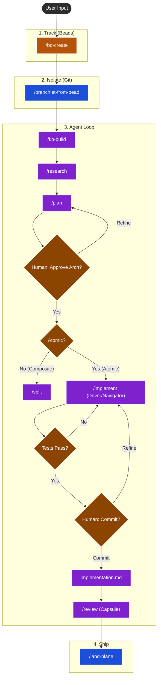

# Amp Agentic Workflow

```
  __  __                 _
 |  \/  |               | |
 | \  / | __ _  ___  ___| |_ _ __ ___
 | |\/| |/ _` |/ _ \/ __| __| '__/ _ \
 | |  | | (_| |  __/\__ \ |_| | | (_) |
 |_|  |_|\__,_|\___||___/\__|_|  \___/
            Amp Maestro
```
A structured workflow for Sourcegraph Amp designed for complex tasks. It adds planning, context management, and sub-agent orchestration.

It utilizes **Beads** (Issue Tracking) and **Branchlet** (Worktrees) to manage agent context and isolation.

## Philosophy

This workflow implements the **"Frequent Intentional Compaction"** methodology championed by HumanLayer.



It enforces a structured process:

1.  **Research**: Understand the problem deeply before touching code.
2.  **Plan**: Create a detailed, architectural plan (with Oracle reasoning).
3.  **Manager/Worker**: The main agent acts as a manager, spawning sub-agents for implementation to keep context clean.
4.  **Compaction**: Regularly summarizing work into durable artifacts (`research.md`, `plan.md`, `implementation.md`, `review.md`, `landing.md`, optional `sessions/*.md`, and bead notes stored via `/bead-notes`) to prevent context window pollution.
5.  **Artifacts over Memory**: Using the filesystem (`.beads/artifacts/`) as long-term memory, linked to Issues (`bd`); `plan.md` defines canonical build/test commands by label, `implementation.md` logs their actual runs and deviations, and `review.md`/`landing.md` consume those same labels for QA evidence.
6.  **Delegated Authority**: Humans must explicitly authorize state changes ("Commit", "Land") via the Driver/Navigator loop and Pre-Flight checklists; agents propose, humans dispose.

## The Stack

*   **[Amp](https://ampcode.com)**: The AI Coding Agent (with Oracle & Sub-agents).
*   **[Beads (bd)](https://github.com/beads-dev/beads)**: Lightweight, CLI-first issue tracking that lives in git.
*   **[Branchlet](https://github.com/raghavpillai/branchlet)**: Git worktree manager for isolated agent environments.
*   **[HumanLayer](https://github.com/humanlayer/humanlayer)**: Creators of the "Context Engineering" and "12-Factor Agent" methodologies this workflow is based on.

## Installation

### Option 1: Quick Install with mise (Recommended)
Run this command in the root of any project where you want to use Amp Maestro:

```bash
# Clone and install with mise
git clone https://github.com/jveko/amp-maestro.git
cd amp-maestro
mise run install
```

Or install individual components:
```bash
mise run install:deps      # Check/install dependencies (bd, branchlet)
mise run install:dirs      # Create required directories
mise run install:commands  # Install slash commands
mise run install:workflow  # Install workflow docs
mise run install:agents    # Setup AGENTS.md
```

### Option 2: Quick Install (Shell Script)
Run this command in the root of any project where you want to use Amp Maestro:

```bash
/bin/bash -c "$(curl -fsSL https://raw.githubusercontent.com/jveko/amp-maestro/main/install.sh)"
```

### Option 3: Developer Install (From Source)
Use this if you are contributing to Amp Maestro or want to install from a local copy:

```bash
git clone https://github.com/jveko/amp-maestro.git
cd amp-maestro
./install.sh
```

## What it installs

1.  **Slash Commands** (`.agents/commands/`):
    *   `/bd-create`: Interview-first issue creation.
    *   `/bd-next`: Pick tasks and guide you into a fresh worktree.
    *   `/branchlet-from-bead`: Create an isolated worktree tied to a bead.
    *   `/context`: Load artifacts and summarize current state.
    *   `/kb-build`: Build/update shared repository knowledge.
    *   `/spec`: Turn ambiguous beads into `spec.md`.
    *   `/research`: Deep context gathering (Librarian/MCP).
    *   `/plan`: Oracle-powered implementation planning.
    *   `/split`: Break composite plans into child beads.
    *   `/implement`: Manager/Worker implementation loop with runtime notes.
    *   `/review`: Plan vs. Implementation verification plus QA capsule.
    *   `/land-plane`: Final pre-merge checklist and landing artifact.
    *   `/bead-notes`: Append session summaries back into Beads.

2.  **Protocols**:
    *   `AGENTIC_WORKFLOW.md`: The master protocol document.
    *   Updates your `AGENTS.md` with the required "Source of Truth" rules.

## Usage

1.  **Start**: `amp`
2.  **Pick Work**: `/bd-next` (or `/bd-create` for new ideas).
3.  **Deep Work**: For a chosen bead ID, run `/context <id>` to load artifacts, then follow `/research <id>` → `/plan <id>` → `/implement <id>` → `/review <id>`.
    *   **Important**: Start a new Amp thread after each command to ensure clean context.
    *   **Note**: Commands populate the chat with a prompt. **Paste the Bead ID** at the end of the command before sending.
    *   During `/implement`, copy the canonical build/test command labels from the Test Plan in `.beads/artifacts/<id>/plan.md` into `.beads/artifacts/<id>/implementation.md`, and record actual runs and deviations there instead of ever editing `plan.md`; `/review` and `/land-plane` always refer back to those same labeled commands.
4.  **Finish**: `/land-plane` to sync beads, commits, and next steps.

## Slash Command Playbook

| Command | Stage | Why/When |
| :--- | :--- | :--- |
| `/bd-create` | Track | Capture new work as a Bead with lineage and priority. |
| `/bd-next` | Track → Setup | Let Amp propose the best bead to pull next and tee up `/branchlet-from-bead`. |
| `/branchlet-from-bead` | Isolate | Spawn a dedicated worktree tied to the bead so git state stays focused. |
| `/context` | Setup | Load existing artifacts (`research.md`, `plan.md`, `implementation.md`, notes) into the session. |
| `/kb-build` *(optional)* | Setup | Refresh the shared knowledge base when architecture/code references drift. |
| `/spec` *(optional)* | Research | Turn large or ambiguous beads into a formal `spec.md` before planning. |
| `/research` | Research | Gather code references and write `research.md` so later steps have hard context. |
| `/plan` | Plan | Use the Oracle to derive an executable plan stored in `plan.md`, including a Test Plan that defines canonical build/test commands by label (e.g., `test:unit`, `lint:ci`). |
| `/split` *(conditional)* | Plan | Break composite work into child beads; keeps implementation beads atomic. |
| `/implement` | Work | Run the Driver/Navigator loop: propose, execute, and verify each step with the user. |
| `/review` | Quality | Verify implementation, check for slopsquatting/security risks, and generate a Review Capsule. |
| `/land-plane` | Ship | Run semantic pre-flight checks, revalidate canonical commands, sync beads, and commit. |
| `/bead-notes` *(optional)* | Context Hygiene | Append a concise session summary back to the bead’s notes for future agents. |

## Requirements

*   `git`
*   `mise` ([mise.jdx.dev](https://mise.jdx.dev)) - installs bd and branchlet automatically
*   `amp` CLI installed
*   [Context7 MCP](https://github.com/upstash/context7) (Recommended for `/research` and library docs)
