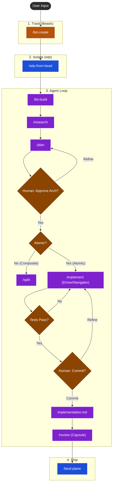

# Amp Agentic Workflow

```
  __  __                 _
 |  \/  |               | |
 | \  / | __ _  ___  ___| |_ _ __ ___
 | |\/| |/ _` |/ _ \/ __| __| '__/ _ \
 | |  | | (_| |  __/\__ \ |_| | | (_) |
 |_|  |_|\__,_|\___||___/\__|_|  \___/
            Amp Maestro
```

A structured workflow for Sourcegraph Amp designed for complex tasks. It adds planning, context management, and sub-agent orchestration.

It utilizes **Beads** (Issue Tracking) and **wtp** (Worktree Plus) to manage agent context and isolation.

## Philosophy

This workflow implements the **"Frequent Intentional Compaction"** methodology championed by HumanLayer.



It enforces a structured process:

1.  **Research**: Understand the problem deeply before touching code.
2.  **Plan**: Create a detailed, architectural plan (with Oracle reasoning).
3.  **Manager/Worker**: The main agent acts as a manager, spawning sub-agents for implementation to keep context clean.
4.  **Compaction**: Regularly summarizing work into durable artifacts (`research.md`, `plan.md`, `implementation.md`, `review.md`, `landing.md`, optional `sessions/*.md`, and bead notes stored via `/bead-notes`) to prevent context window pollution.
5.  **Artifacts over Memory**: Using the filesystem (`.beads/artifacts/`) as long-term memory, linked to Issues (`bd`); `plan.md` defines canonical build/test commands by label, `implementation.md` logs their actual runs and deviations, and `review.md`/`landing.md` consume those same labels for QA evidence.
6.  **Delegated Authority**: Humans must explicitly authorize state changes ("Commit", "Land") via the Driver/Navigator loop and Pre-Flight checklists; agents propose, humans dispose.

## The Stack

| Tool | Purpose | Link |
|------|---------|------|
| **Amp** | AI Coding Agent (with Oracle & Sub-agents) | [ampcode.com](https://ampcode.com) |
| **Beads (bd)** | Lightweight, CLI-first issue tracking in git | [beads-dev/beads](https://github.com/beads-dev/beads) |
| **wtp** | Git worktree manager for isolated environments | [satococoa/wtp](https://github.com/satococoa/wtp) |
| **HumanLayer** | "Context Engineering" methodology foundation | [humanlayer/humanlayer](https://github.com/humanlayer/humanlayer) |

## Installation

### Prerequisites

- `git`
- `mise` ([mise.jdx.dev](https://mise.jdx.dev)) - for installing `bd`
- `brew` (Homebrew) - for installing `wtp`
- `amp` CLI installed

### Option 1: Quick Install with mise (Recommended)

```bash
git clone https://github.com/jveko/amp-maestro.git
cd amp-maestro
mise run install
```

Or install individual components:
```bash
mise run install:deps      # Check/install dependencies (bd, wtp)
mise run install:dirs      # Create required directories
mise run install:commands  # Install slash commands
mise run install:workflow  # Install workflow docs
mise run install:agents    # Setup AGENTS.md
```

### Option 2: Quick Install (Shell Script)

```bash
/bin/bash -c "$(curl -fsSL https://raw.githubusercontent.com/jveko/amp-maestro/main/install.sh)"
```

### Option 3: Developer Install (From Source)

```bash
git clone https://github.com/jveko/amp-maestro.git
cd amp-maestro
./install.sh
```

## What Gets Installed

### Directory Structure
```
your-project/
├── .agents/commands/       # Slash command definitions
├── .beads/
│   ├── artifacts/          # Per-bead artifacts (research.md, plan.md, etc.)
│   ├── kb/                 # Shared knowledge base
│   └── issues.jsonl        # Issue database
├── .wtp.yml                # Worktree configuration
├── AGENTS.md               # Agent guidelines
└── AGENTIC_WORKFLOW.md     # Protocol documentation
```

### Slash Commands

| Command | Stage | Description |
|---------|-------|-------------|
| `/bd-create` | Track | Interview-first issue creation with lineage |
| `/bd-next` | Track → Setup | Pick tasks and guide into a fresh worktree |
| `/wtp-from-bead` | Isolate | Create an isolated worktree tied to a bead |
| `/context` | Setup | Load artifacts and summarize current state |
| `/kb-build` | Setup | Build/update shared repository knowledge |
| `/spec` | Research | Turn ambiguous beads into formal `spec.md` |
| `/research` | Research | Deep context gathering with code citations |
| `/plan` | Plan | Oracle-powered implementation planning |
| `/split` | Plan | Break composite plans into child beads |
| `/implement` | Work | Manager/Worker loop with runtime notes |
| `/review` | Quality | Plan vs. Implementation verification + QA capsule |
| `/land-plane` | Ship | Final pre-merge checklist and landing |
| `/bead-notes` | Context | Append session summaries back into Beads |

## Usage

### Quick Start

```bash
# 1. Start Amp
amp

# 2. Create or pick work
/bd-create          # Create new issue
/bd-next            # Pick from backlog

# 3. Deep work cycle (start new thread after each command)
/context <id>       # Load context
/research <id>      # Gather code references
/plan <id>          # Create implementation plan
/implement <id>     # Execute with Driver/Navigator loop
/review <id>        # Verify and generate Review Capsule

# 4. Ship
/land-plane <id>    # Pre-flight checks, commit, push
```

### Best Practices

- **Start a new Amp thread** after each slash command for clean context
- **Paste the Bead ID** at the end of commands before sending
- During `/implement`, copy canonical build/test labels from `plan.md` into `implementation.md`
- Never edit `plan.md` after approval—use `implementation.md` for deviations

### wtp Commands Reference

| Action | Command |
|--------|---------|
| Initialize config | `wtp init` |
| Create worktree | `wtp add -b <branch>` |
| Enter worktree | `wtp cd <branch>` |
| List worktrees | `wtp list` |
| Remove worktree | `wtp remove <branch>` |
| Remove with branch | `wtp remove --with-branch <branch>` |

## Artifact Flow

```
plan.md (immutable after approval)
    ↓ defines canonical commands
implementation.md (logs runs + deviations)
    ↓ references command labels
review.md (QA evidence)
    ↓ revalidates same commands
landing.md (final QA rerun)
```

## License

MIT
