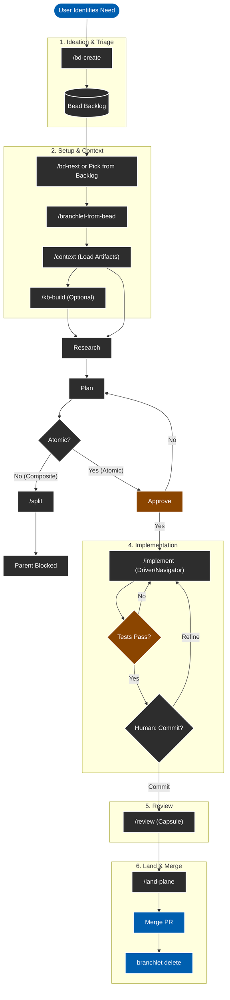

# Agentic Workflow Protocol

This protocol defines the mandatory workflow for AI agents (Amp) working in this repository. It integrates **Beads** (Issue Tracking), **Branchlet** (Worktrees), and **Slash Commands** (HumanLayer Protocol).

## 1. Ideation & Triage
- **User**: Run `/bd-create` (or identify a need).
- **Agent**: 
  - Interviews user to understand scope.
  - Generates title/priority/type.
  - Identifies lineage (blocks/discovered-from).
- **Outcome**: A Bead ID (e.g., `bd-a1b2`) exists in the backlog.

## 2. Setup & Context
- **User**: Run `/bd-next` to pick a task.
- **Agent**: Proposes top candidates. User selects `bd-a1b2`.
- **User**: Run `/branchlet-from-bead bd-a1b2` (Recommended) or switch branch.
- **User**: Run `/context bd-a1b2`.
  - **Agent**: Loads existing artifacts and summarizes state.
- **User (Optional)**: Run `/kb-build`.
  - **Agent**: Scans codebase to build/update shared architecture docs in `.beads/kb/`.

## 3. Research & Spec (Start New Thread)
- **User**: Run `/spec bd-a1b2` (Optional but recommended).
  - **Agent**: Refines Bead into a formal `spec.md`.
- **User**: Run `/research bd-a1b2`.
  - **Agent**: Scans codebase and builds layered context (System, Domain, Task) in `.beads/artifacts/bd-a1b2/research.md`.
  - **Context Engineering**: Explicitly hunts for existing patterns to prevent drift.

## 4. Planning (Start New Thread)
- **User**: Run `/plan bd-a1b2`.
  - **Agent**: Conducts **Architectural Interview** to verify approach against patterns.
  - **Agent (Oracle)**: reasoning -> `.beads/artifacts/bd-a1b2/plan.md`.
- **Plan Artifact**: Every plan includes a `## Child Beads` appendix reserved for `/split`; the remainder stays read-only once approved. The Test Plan section defines all canonical build/test commands by label (for example `test:unit`, `lint:ci`); those labels are reused unchanged by `/implement`, `/review`, and `/land-plane`.
- **Split Decision**: Agent analyzes complexity.
  - **Composite**: Agent runs `/split` to create child beads. Parent becomes blocked.
  - **Atomic**: Plan is approved for immediate implementation.

## 5. Implementation (Start New Thread)
- **User**: Run `/implement bd-a1b2`.
  - **Agent (Manager)**: Runs the **Driver/Navigator Loop**.
  - **Loop**: 
    1. **Propose**: State intent and pattern match.
    2. **Execute**: Run subagent/task.
    3. **Pair Check**: Stop and ask user "Commit, Refine, or Revert?".
    4. **Decision**: User must explicitly authorize the commit to proceed to the next step.
  - **Agent**: Updates `implementation.md` with results and syncs docs if architecture changed.
  - **Agent**: Verifies builds/tests so that every canonical command in the plan has a recent, passing run recorded in `implementation.md`.

## 6. Review (Start New Thread)
- **Trigger**: Implementation passes local verification.
- **User**: Run `/review bd-a1b2`.
  - **Agent**: Audits the diff against `plan.md`/`spec.md`.
  - **Security Gate**: Runs mandatory dependency check (Anti-Slopsquatting) and input validation search.
  - **Agent**: Generates a PR-ready **Review Capsule**.
  - **Outcome**: Clear go/no-go signal plus documented deviations.

## 7. Land & Merge (Start New Thread)
- **Prereq**: `/review` is complete (or explicitly skipped with rationale).
- **User**: Run `/land-plane bd-a1b2`.
  - **Agent**: Runs semantic pre-flight checklist (Migrations? Secrets? PII?).
  - **Agent**: Verifies review artifacts are approved before touching git.
  - **Agent**: Runs final linters/tests by revalidating the same canonical commands recorded in `implementation.md`, files/updates beads, and syncs `bd`.
  - **Agent**: Writes QA revalidation results into `.beads/artifacts/<id>/landing.md` so that `implementation.md` and `review.md` remain immutable after their stages complete.
  - **Agent**: For multiple active branchlets, land beads sequentially per the `/land-plane` command template.
  - **Agent**: Commits with `Refs <id>` and optionally pushes.
- **User**: Merge Pull Request.
- **User**: `branchlet delete` (cleanup).

## 8. Parallelism & Swarms (Epic Structure)
To complete Epics faster, structure Beads for **maximum parallel agent execution**:

1.  **The "Epic" Bead (The Manager)**
    - **Role**: Holds the master `research.md` and `plan.md`.
    - **Action**: Runs `/plan` and `/split`.
    - **Never**: Writes code directly.

2.  **The "Task" Beads (The Workers)**
    - **Role**: Single, independent unit of work (e.g., "Create UI Component", "Add DB Migration").
    - **Independence**: Must be solvable *without* waiting for other Tasks (unless explicitly blocked).
    - **Context**: Description MUST link to `.beads/artifacts/<EPIC_ID>/plan.md`.

3.  **Dependency Graphing**
    - **Sequential**: If Task B needs Task A's code, `bd create "Task B" --deps blocks:bd-A`.
    - **Parallel (Fan-out)**: If Task A and B are independent, they both just block the Epic.
  - **Agent Swarm**: You can launch multiple terminal tabs, creating a `branchlet` for each Task, and run `/implement` in parallel. Reference the `/land-plane` checklist when wrapping up each bead.

## 9. Context Hygiene
To ensure maximum reliability and avoid context window pollution:
- **Always start a new Amp thread** after running a slash command (e.g., after `/plan` finishes start a new thread for `/implement`, then fresh threads for `/review` and `/land-plane`).
- This ensures the agent focuses only on the current step's artifacts (`plan.md`, `research.md`) without being distracted by the conversation history of previous steps.
- **Command Usage**: Slash commands populate the chat with a prompt template. **Always paste the Bead ID** at the end of the prompt (e.g., `/research bd-a1b2`) before sending.
- **Artifact Discipline**: Treat `plan.md` as immutable after approval (except for `/split` appendices), keep execution deviations and test runs in `implementation.md`, record review outcomes and QA evidence in `review.md`, and use `landing.md` only for landing-time QA revalidation; `sessions/*.md` are optional append-only logs surfaced by `/context` but not required for correctness.

## Summary of Tools
| Tool | Purpose |
| :--- | :--- |
| `bd` | Source of Truth (Status, Title, What) |
| `.md Artifacts` | Context (Research, Plan, Implementation log, Review) - *Stored in .beads/artifacts/* |
| `branchlet` | Isolation (Filesystem, Git state) |
| `slash commands` | Protocol Enforcement (The "Verbs") |

## Slash Command Reference

| Command | Stage | Why/When |
| :--- | :--- | :--- |
| `/bd-create` | Ideation | File new beads with lineage and priority. |
| `/bd-next` | Setup | Select the next bead to execute. |
| `/branchlet-from-bead` | Setup | Create an isolated worktree tied to the bead. |
| `/context` | Setup | Load artifacts and summarize the bead’s current state. |
| `/kb-build` *(optional)* | Setup | Refresh `.beads/kb/` when architecture knowledge is stale. |
| `/spec` *(optional)* | Research | Produce `spec.md` for complex/ambiguous beads before planning. |
| `/research` | Research | Gather code references, identify existing patterns, and write `research.md`. |
| `/plan` | Plan | Interview user on architecture, then use Oracle to derive `plan.md`. |
| `/split` *(conditional)* | Plan | Break composite work into child beads; keeps implementation beads atomic. |
| `/implement` | Work | Run the Driver/Navigator loop: propose, execute, and verify each step with the user. |
| `/review` | Quality | Verify implementation, check for slopsquatting/security risks, and generate a Review Capsule. |
| `/land-plane` | Ship | Run semantic pre-flight checks, revalidate canonical commands, sync beads, and commit. |
| `/bead-notes` *(optional)* | Context Hygiene | Append a concise session summary back to the bead’s notes for future agents. |
